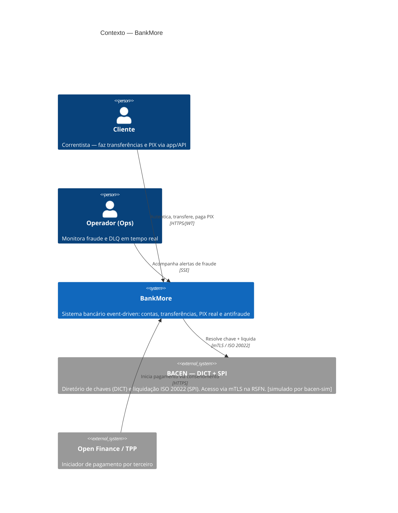
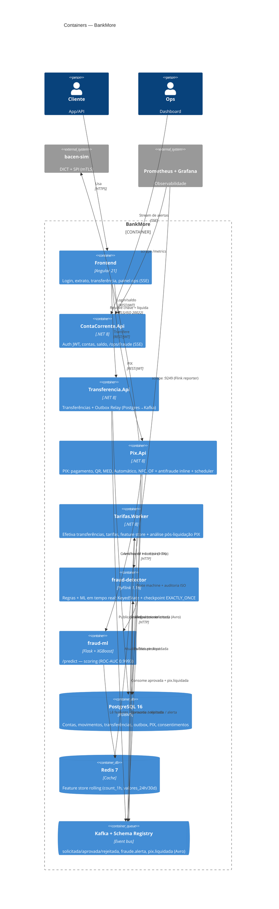
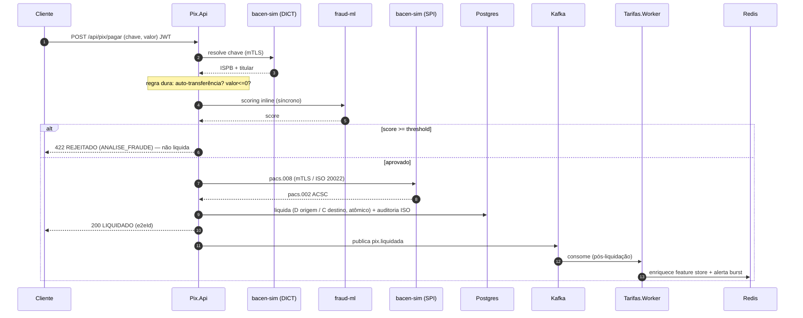
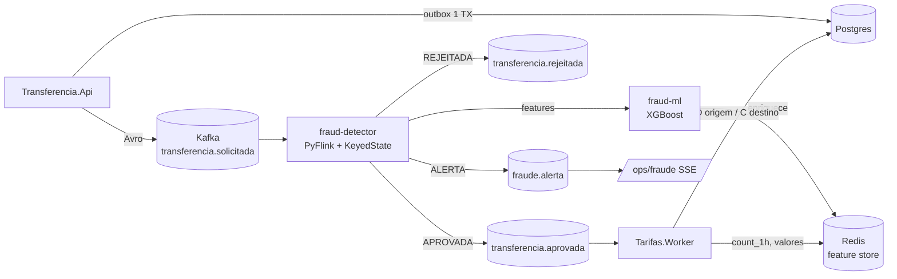

# Arquitetura — BankMore (modelo C4)

Sistema bancário event-driven com **PIX real** (DICT, ISO 20022, MED, QR EMVCo,
PIX Automático, NFC, Open Finance), **mTLS na RSFN** e **detecção de fraude em
tempo real** (PyFlink + XGBoost) em **dois níveis** (inline + streaming).

Stack: **.NET 8** · **PyFlink 1.18** · **XGBoost** · **Kafka** · **Redis** ·
**PostgreSQL 16** · **Angular 21** · **Prometheus/Grafana** · **Docker Compose**.

---

## C4 — Nível 1: Contexto do Sistema

---

## C4 — Nível 2: Containers

---

## Fluxo PIX — pagamento por chave (com antifraude em 2 níveis)

---

## Fluxo Transferência — fraud detection em streaming

---

## Infra (Docker Compose — 16 serviços)

| Grupo | Serviços | Portas |
|---|---|---|
| **APIs .NET** | contacorrente-api, transferencia-api, pix-api, bacen-sim | 5000 / 5001 / 5006 / 5005·5443(mTLS) |
| **Worker / ML** | tarifas-worker, fraud-ml | 9102(metrics) / 5003 |
| **Streaming** | fraud-detector (PyFlink), flink-jobmanager, flink-taskmanager | 9249 / 8082 |
| **Mensageria** | kafka, zookeeper, schema-registry, kafka-ui | 9092 / 8085 / 8080 |
| **Dados** | postgres, redis | 5432 / 6379 |
| **Observabilidade** | prometheus, grafana | 9090 / 3000 |

**Segurança:** JWT (PBKDF2) · mTLS na RSFN (CA → bacen-sim/pix-api) · auth admin fail-closed.
**Resiliência:** Outbox + DLQ · idempotência · fail-open no ML · checkpoint EXACTLY_ONCE.
**Qualidade:** `make e2e` (7 cenários) + `make e2e-pix` (10 fluxos) · 19 ADRs.
